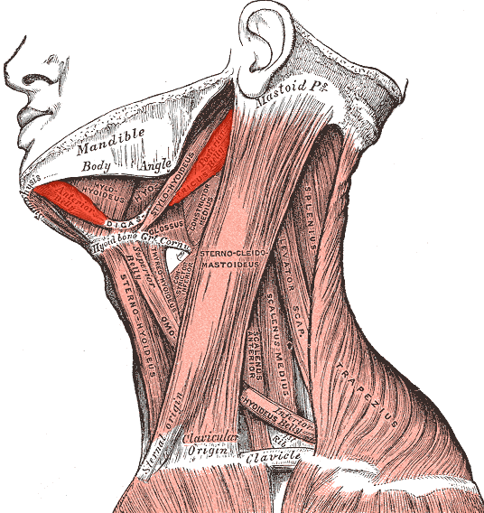
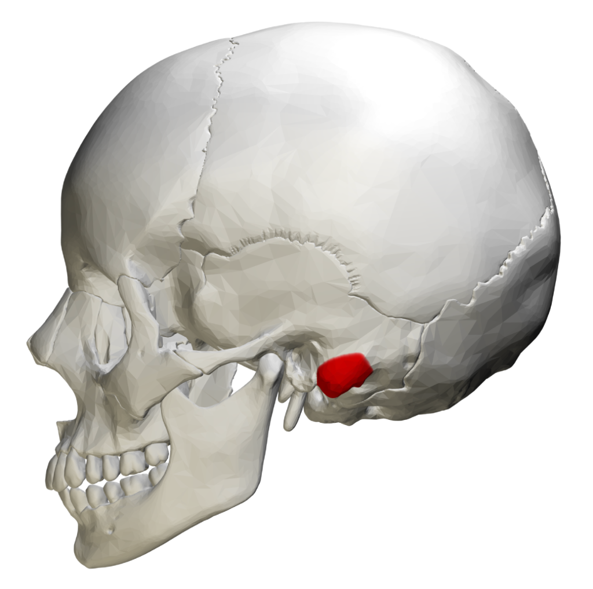

# Section 1: Data Explanation

## Dataset Overview

This project uses **single-channel surface EMG (sEMG) signals** captured from submental muscles during silent speech tasks. The data represents an extension of the Phase 3 single-lead forearm EMG dataset to silent speech recognition—an attempt to replicate MIT Media Lab's **AlterEgo** system for **$30** instead of **$1,200+**.

> [!NOTE]
> **Design Change:** Originally planned as a dual-channel system (chin + jaw), this project was adapted to single-channel due to hardware limitations discovered during testing. See **[Hardware Adaptation](#hardware-adaptation-dual-to-single-channel)** below.

## Data Source

### Personal Digital Archive Origin
- **Creator:** Carl Vincent Ladres Kho (Minerva University)
- **Collection Period:** December 2024
- **Location:** Taipei, Taiwan (components from Guang Hua Digital Plaza)
- **Context:** Final assignment for CS156 Machine Learning Pipeline

---

## Hardware Acquisition: The Guang Hua Run

Components were purchased from **Jin Hua Electronics (今華電子)** in Guang Hua Digital Plaza, Taipei.

### Component List (~$30 USD Total)

| Component | Source | Cost (TWD) | Purpose |
|-----------|--------|------------|---------|
| **AD8232 x2** | Jin Hua Electronics | ~$300 each | Originally for dual-channel (see adaptation below) |
| **ESP32 (NodeMCU-32S)** | Jin Hua | ~$180 | MCU @ 1000Hz sampling, 3.3V logic |
| **Ag/AgCl Electrodes (50-pack)** | Medical supply | ~$200 | Conductive gel pads with metal snap |
| **Shielded Audio Cable** | Jin Hua | ~$80 | Noise reduction (cut to <20cm) |
| **USB Power Bank** | Existing | - | **Safety: NEVER use wall power** |

### The "Accidental Hardware Match"

The **AD8232** is designed for ECG (heart monitoring), but its hardware bandpass filter is accidentally perfect for speech EMG:

| System | Target Frequency | AD8232 Filter |
|--------|------------------|---------------|
| MIT AlterEgo | 1.3Hz – 50Hz | ✓ |
| AD8232 Native | 0.5Hz – 40Hz | Hardware match! |

**No software filtering was needed—the hardware does it mechanically.**


---

## Hardware Adaptation: Dual to Single Channel

> [!IMPORTANT]
> **This section documents a critical pivot during the project.** Full troubleshooting logs are available in [working_process/](../working_process/).

### Original Plan: Dual-Channel (Chin + Jaw)

The initial design followed AlterEgo's multi-site approach:
- **Channel 1:** Under-chin (Digastric/Mylohyoid) — Tongue position
- **Channel 2:** Jaw/Cheek (Masseter) — Jaw intensity

### The Problem: AD8232 Baseline Mismatch

During hardware validation ([2024-12-19_dual_ad8232_troubleshooting.md](../working_process/2024-12-19_dual_ad8232_troubleshooting.md)), the two AD8232 sensors exhibited significantly different baseline ADC values:

| Sensor | Baseline ADC | Heart LED | Status |
|--------|--------------|-----------|--------|
| AD8232 #1 (Red PCB) | ~1.8K | Flickering ✅ | Working |
| AD8232 #2 (Purple PCB) | ~3.8K | NOT flickering ⚠️ | Saturation risk |

**Serial Monitor Capture:**
```
ADC: 3796 | LO+: 1 | LO-: 1 | Status: ✓ Board responding
ADC: 3823 | LO+: 1 | LO-: 1 | Status: ✓ Board responding
ADC: 3921 | LO+: 1 | LO-: 1 | Status: ⚠️ ADC RAILING HIGH
```

The second sensor's baseline near the 12-bit ADC ceiling (4095) meant any muscle activation would saturate the signal, losing critical amplitude information.

### The Decision: Single-Channel Focus

After extensive troubleshooting documented in video ([Loom Recording](https://www.loom.com/share/a893fc0e55334356979a57ffecdbcfa3)), a pragmatic decision was made:

> **Use only the working AD8232 for the under-chin (Digastric) channel.**

This was informed by the analysis in [2024-12-19_single_channel_discrimination.md](../working_process/2024-12-19_single_channel_discrimination.md):

| Feature Type | Dual-Channel | Single-Channel |
|--------------|--------------|----------------|
| Spatial (chin vs jaw ratio) | ✅ | ❌ Lost |
| Temporal (firing sequence) | ✅ | ✅ Preserved |
| Frequency (ZCR, spectral) | ✅ | ✅ Preserved |

**Key Insight:** With single-channel, the model must rely on **temporal + frequency features** (~90%) rather than spatial discrimination. This is feasible because:
1. Each word has a distinct **sequence of muscle activation**
2. Different tongue movements create different **EMG frequency signatures**
3. Our vocabulary was chosen for **maximal phonetic contrast**

---

## Critical Hardware Fixes

### 1. The SDN Pin Fix (Discovered in Phase 3)

> **⚠️ CRITICAL:** The AD8232's Shutdown (SDN) pin floats on generic clones, causing massive signal instability.

**Solution:** Wire SDN to 3.3V (HIGH) directly on the ESP32.

```
ESP32    →    AD8232
3.3V     →    3.3V
GND      →    GND
3.3V     →    SDN (CRITICAL FIX!)
GPIO34   →    OUTPUT
```

### 2. Cable Shielding (Noise Reduction)

The stock 3-lead cable (~1 meter) acts as an antenna for 60Hz noise.

**The Fix:**
1. **Cut cable to <20cm** (face-to-board distance)
2. **Twisted Pair:** Twist Signal+ and Signal- wires together (maximizes CMRR)
3. Or use **shielded microphone cable**

---

## Electrode Placement

### Single-Channel Configuration

With one working AD8232, we focus on the under-chin position which captures **tongue movement**—the primary discriminator for our vocabulary.

### Anatomical Reference

The electrode placement targets two key anatomical structures:

**1. Digastric/Mylohyoid Muscle (Signal Electrodes)**



*Figure: Lateral view of neck musculature with digastric muscle highlighted in red. This muscle group under the chin contracts during tongue movement—our primary signal source. (Gray's Anatomy, Public Domain)*

**2. Mastoid Process (Ground Electrode)**



*Figure: Skull showing mastoid process (red) behind the ear. This bony prominence provides an electrically neutral reference point for the ground electrode. (Wikimedia Commons, CC BY-SA 4.0)*

### Electrode Configuration


**Digastric/Mylohyoid (Under-Chin) — Tongue Tracker**

| Electrode | Placement | Purpose |
|-----------|-----------|---------|
| **Signal+ (Red)** | Under-chin, left of centerline | Tongue movement detection |
| **Signal- (Yellow)** | Under-chin, right of centerline, 2-3cm apart | Differential signal |
| **Reference (Green)** | Mastoid process (behind ear) | Electrically neutral ground |

### 3.5mm Jack Wiring Mapping

Confirmed via testing ([2024-12-18_wiring_mapping_session.md](../working_process/2024-12-18_wiring_mapping_session.md)):

| 3.5mm Plug Segment | Wire Color | Body Placement |
|--------------------|------------|----------------|
| **Tip** | Yellow | Signal- (right of centerline) |
| **Ring (Middle)** | Green | Reference (mastoid) |
| **Sleeve (Back)** | Red | Signal+ (left of centerline) |

---

## Hardware Validation Protocol

To ensure signal integrity before data collection, a 3-step "Parking Lot Test" was performed:

**Step 1: Heartbeat Sanity Check**
- Electrodes on chest.
- **Success Criteria:** Clean, rhythmic QRS complex (heartbeat) every ~1s.
- **Purpose:** Verifies sensor and ADC functionality.

**Step 2: Jaw Clench Noise Check**
- Electrodes on Jaw. Bite down hard.
- **Success Criteria:** Signal "explodes" into high-amplitude chaos (>2000 units).
- **Purpose:** Verifies electrodes are making contact and amplifier isn't saturated.

**Step 3: Subvocalization "Wiggle"**
- Electrodes on Chin. Say "GHOST" internally.
- **Success Criteria:** Small but distinct disturbance from baseline noise.
- **Purpose:** Confirms detection of fine motor units in the tongue.

---

## Vocabulary Selection: "Tongue Gymnastics"

Words were chosen based on **distinct neuromuscular signatures**, not semantic meaning.

### The Insight

> *"You are building a Biological Keyboard, not a Telepathy Helmet."*

Since electrodes are under the chin, we're tracking **tongue position**, not sound. Choose words that force the tongue to do radically different things.

### Tier 1: High Success Rate (Used in Data Collection)

| Word | Tongue Physics | Expected Signal |
|------|----------------|-----------------|
| **GHOST** | Back of tongue → soft palate ("G" slam) | ⭐⭐⭐⭐⭐ High-frequency burst |
| **LEFT** | Tongue tip → alveolar ridge ("L" touch) | ⭐⭐⭐⭐ Distinct onset |
| **STOP** | Plosive "ST" + "P" = jaw engagement | ⭐⭐⭐⭐ Combined signal |
| **REST** | Tongue flat, relaxed | Control (silence) |

### Tier 2: Control Word

**"MAMA"** — Lips only (Orbicularis Oris). Tongue stays flat.
- **Purpose:** If you subvocalize "MAMA" and see a chin signal spike, you're picking up **noise**, not muscle.

---

## The Motor Intensity Spectrum

### 5-Level "Descending Motor Intensity" Framework

To validate the low-cost hardware, we employ a **Transfer Learning** strategy across the motor intensity spectrum.

> **The Insight:** Training on "Open Mouth" movements (Mouthing) provides strong, high-amplitude signals that help the model learn the temporal dynamics of each word. We then transfer this knowledge to "Closed Mouth" (Silent Articulation) scenarios.

| Level | Terminology | Description | Signal | Role |
|-------|-------------|-------------|--------|------|
| 1 | **Overt Speech** | Natural speaking voice | 🔊🔊🔊🔊🔊 | Calibration |
| 2 | **Whisper** | Low-volume vocalization | 🔊🔊🔊🔊 | Calibration |
| 3 | **Mouthing** | **Open-Mouth** silent speech with maximal jaw excursion | 🔊🔊🔊 | **Training Data** (Source) |
| 4 | **Silent Articulation** | **Closed-Mouth** speech with exaggerated internal tongue movement | 🔊🔊 | **Testing Data** (Target) |
| 5 | **Imagined Speech** | Minimal/Micro-movements (Reading to self) | 🔊 | Exploratory |

### Data Collected (December 19, 2024)

Full capture session documented in [2024-12-19_speech_spectrum_capture_session.md](../working_process/2024-12-19_speech_spectrum_capture_session.md).

| Level | Cycles | Words | Output File |
|-------|--------|-------|-------------|
| L1 Overt | 10 | GHOST, LEFT, STOP, REST | `overt_data.csv` |
| L2 Whisper | 10 | GHOST, LEFT, STOP, REST | `whisper_data.csv` |
| L3 Mouthing | 50 | GHOST, LEFT, STOP, REST | `mouthing_data.csv` |
| L4 Subvocal | 51+ | GHOST, LEFT, STOP, REST | `subvocal_data.csv` |
| L5 Imagined | 10 | GHOST, LEFT, STOP, REST | `imagined_data.csv` |

### Transfer Learning Rationale
**Open (Level 3) → Closed (Level 4)**

We assume that the *temporal sequence* of muscle activation (e.g., G-H-O-S-T) remains consistent between open and closed mouth states, even if the *amplitude* changes.
- **Training (Level 3):** Learn the neuromuscular "signature" of the word with high Signal-to-Noise Ratio (SNR).
- **Inference (Level 4):** Detect the same signature in the constrained, closed-mouth environment.

---

## Known Confounds & Limitations

> [!WARNING]
> **Researcher Honesty:** The following artifacts were observed during data collection and should be considered when interpreting results.

Documented in [2024-12-19_speech_spectrum_capture_session.md](../working_process/2024-12-19_speech_spectrum_capture_session.md):

| Confound | Description | Impact |
|----------|-------------|--------|
| **Saliva Swallowing** | Periodic swallowing creates spurious EMG bursts | May contaminate REST labels |
| **Post-Mouthing Tension** | After L3 trials, chin muscles remain partially activated ("pufferfishing") | REST after mouthing ≠ true baseline |
| **Syllabic Beat Artifact** | Involuntary micro-movement synchronized to word rhythm, even in L5 | "Pure mental" may still contain motor artifacts |
| **Recording Timing** | Words vocalized at countdown "2" (not "1" or "3") to center signal in window | Consistent across all levels |

---

## Prior Work Context

This dataset builds on **Phase 3** (Kho, 2024), which validated:
- AD8232 sensor efficacy for EMG capture (SDN pin fix discovered)
- 18 ML architecture benchmark on 1.54M data points
- Random Forest as Pareto-optimal for ESP32 deployment (74% accuracy, 0.01ms)
- MaxCRNN achieving 99% precision on safety-critical class

---

## Sampling Methodology

| Parameter | Value | Rationale |
|-----------|-------|-----------|
| **Sampling Rate** | 1000Hz | Nyquist: fₛ > 2×450Hz (EMG bandwidth) |
| **ADC Resolution** | 12-bit (0-4095) | ESP32 native |
| **Window Size** | 3 seconds per word | Countdown-aligned (vocalize at "2") |
| **Channels** | 1 (single AD8232) | Under-chin only (see [Hardware Adaptation](#hardware-adaptation-dual-to-single-channel)) |
| **Power Source** | USB Battery Bank | **Safety: No wall power with face electrodes** |

---

## References

1. Kapur, A., Kapur, S., & Maes, P. (2018). AlterEgo: A personalized wearable silent speech interface. *23rd International Conference on Intelligent User Interfaces*, 43-53. https://doi.org/10.1145/3172944.3172977

2. Kho, C. V. (2024). Phase 3: EMG-Based Gesture Classification with AD8232. *Minerva University CS156 Project Archive*.

3. Analog Devices. (2012). AD8232: Single-Lead, Heart Rate Monitor Front End. *Datasheet*. https://www.analog.com/media/en/technical-documentation/data-sheets/ad8232.pdf
