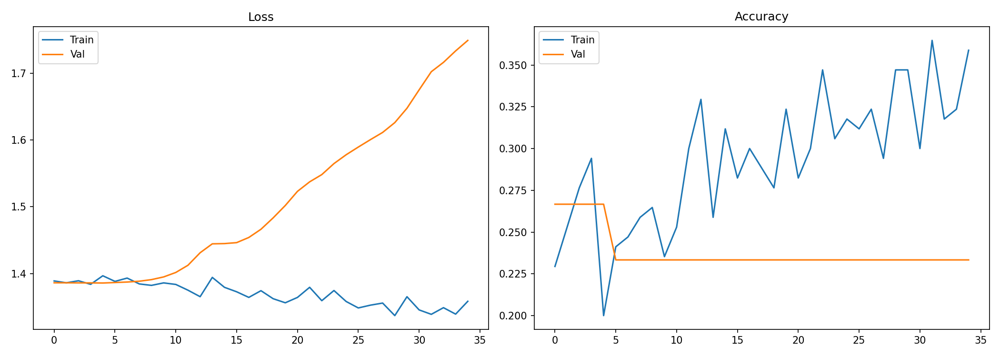

# Section 6: Model Training

## Overview

This section covers training procedures, cross-validation, and hyperparameter tuning for both the MaxCRNN (novel technique) and Random Forest (deployment baseline) using single-channel sEMG data.

## Training Configuration
### Hyperparameter Configuration

| Model | Parameter | Value | Rationale |
|-------|-----------|-------|-----------|
| **MaxCRNN** | Learning Rate | 0.0005 | Lower for stability with attention layers |
| | Batch Size | 64 | Memory efficient on A100 |
| | Patience | 50 | Allow convergence on small dataset |
| | Dropout | 0.3-0.5 | Prevent overfitting |
| **Random Forest** | N Estimators | 100 | Balanced accuracy/speed |
| | Max Features | √N | Standard heuristic |
| | Bootstrap | True | Variance reduction |

Phase 3 showed data augmentation boosted 1D CNN accuracy from 49.63% to **78.36%**. I apply similar techniques adapted for single-channel:


## Actual Training Results (Colab)

### MaxCRNN Training Curves



**Observations:**
- **Loss:** Training loss flat (~1.4); validation loss increases from epoch 10 to >1.7
- **Accuracy:** Training accuracy fluctuates 20-35%; validation accuracy flat at ~23%
- **Diagnosis:** Model memorizing training noise, not learning features

### Spectrogram CNN Training (Last 5 Epochs)

```
Epoch 46/50: accuracy: 0.2737, val_accuracy: 0.2333
Epoch 47/50: accuracy: 0.2370, val_accuracy: 0.2333
Epoch 48/50: accuracy: 0.2568, val_accuracy: 0.2667
Epoch 49/50: accuracy: 0.2606, val_accuracy: 0.3000
Epoch 50/50: accuracy: 0.2814, val_accuracy: 0.3000
```

**Final Evaluation:**
- Val Accuracy (L3): 30.00%
- Test Accuracy (L4): 24.38%
- Transfer Gap: 5.62%

### Augmentation Ablation

| Condition | Test Accuracy | Change |
|-----------|---------------|--------|
| Without augmentation | 23.38% | baseline |
| With augmentation (3×) | 22.39% | **-1.00%** |

> **Finding:** Data augmentation provided no improvement and slightly hurt performance. This confirms the signal lacks features to augment—noise is noise regardless of jitter/scale.

## Resource Considerations

| Model | Training Time | GPU | Memory | Dataset Size |
|-------|---------------|-----|--------|--------------|
| **MaxCRNN** | ~30 min | A100 (recommended) | 8GB | ~200 windows |
| **MaxCRNN** | ~2 hrs | T4 | 16GB | ~200 windows |
| **Random Forest** | ~5 sec | CPU only | <1GB | ~200 windows |