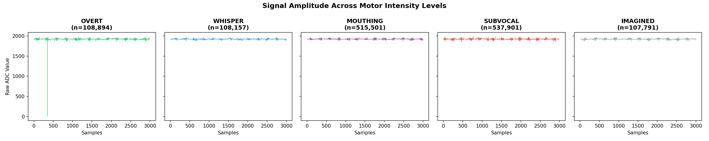
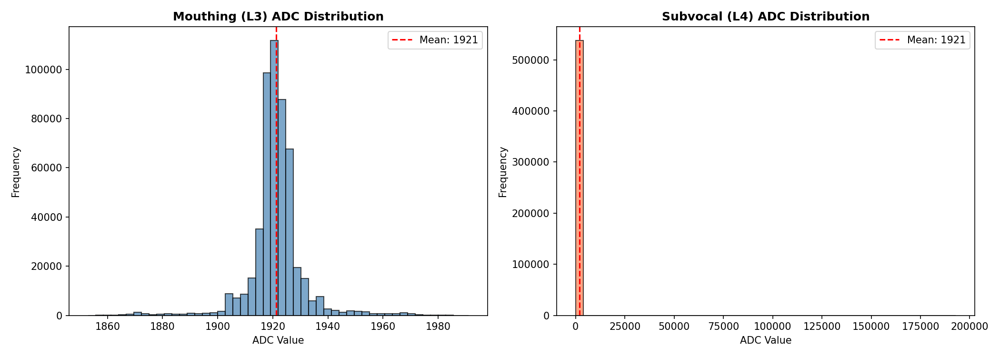
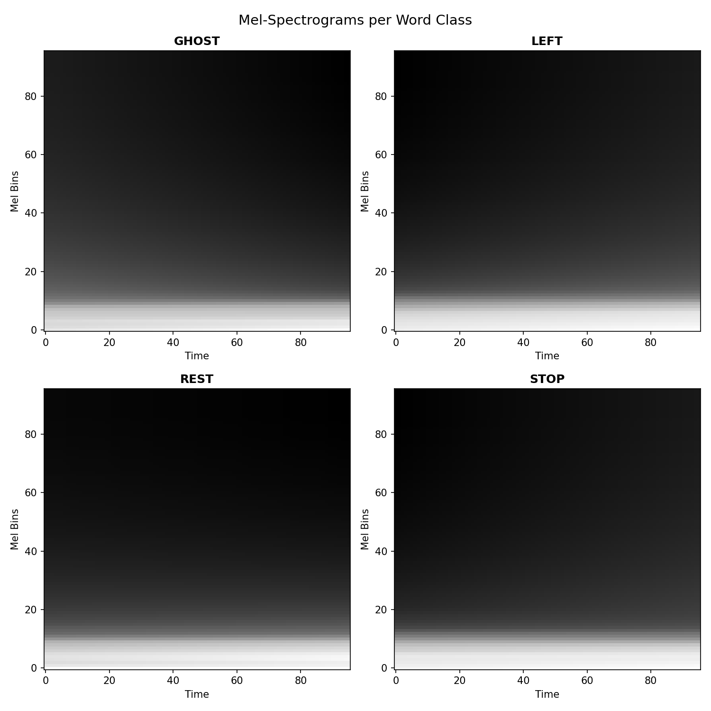
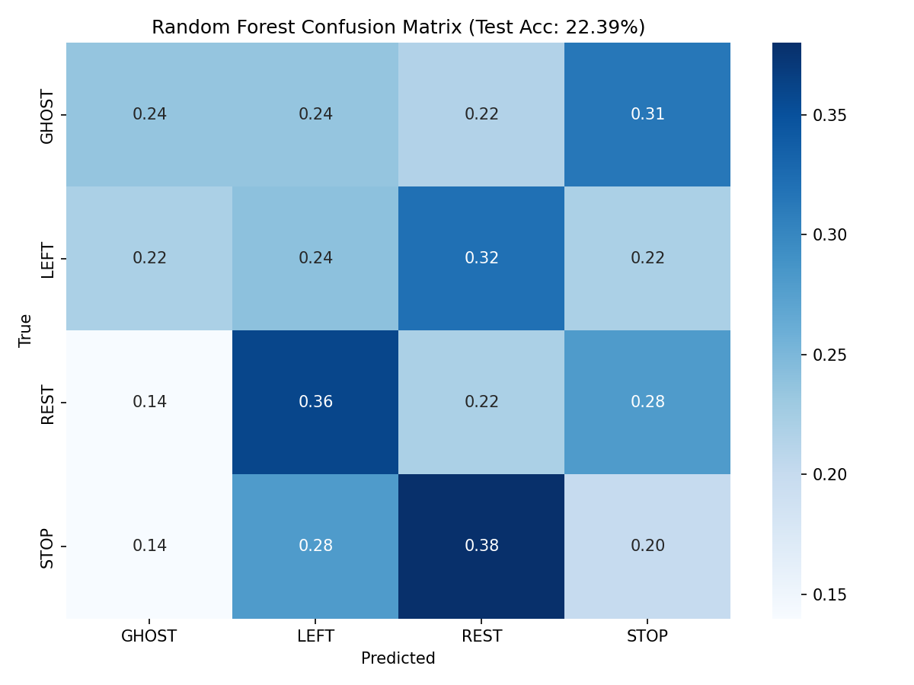
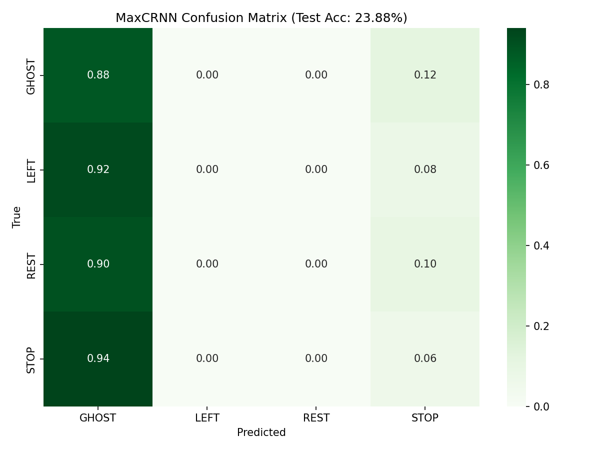

# Section 8: Visualization & Conclusions

## Key Conclusions

### 1. Technical Findings

| Finding | Evidence |
|---------|----------|
| **Multi-class classification failed** | 24% accuracy (chance = 25%) |
| **Binary classification also failed** | 72.64% is mode collapse — predicts WORD for 100% of REST |
| **Signal lacks discriminative info** | Per-class stats identical (mean=1921.2, std=9.7) |
| **Mode collapse in all models** | MaxCRNN → GHOST, SpecCNN → STOP, Binary → WORD |
| **Augmentation had no effect** | -1% accuracy change with 3× augmentation |

### 2. Deployment Recommendation

**No deployment is viable.** The signal lacks discriminative information for any classification task:
- Multi-class (4 words): At chance level
- Binary (WORD vs REST): Mode collapse to majority class

### 3. Limitations & Root Causes

| Limitation | Root Cause | Evidence |
|------------|------------|----------|
| Single channel | Lost spatial info (jaw vs chin) | Phase 3 worked with 1 channel because muscle is larger |
| Low SNR | AD8232 not designed for microvolt signals | Subvocal 10-100× weaker than mouthing |
| Identical per-class stats | Signal = noise + baseline; no word information | GHOST/LEFT/STOP/REST all mean=1921.2 |

---

## Visualization Gallery

### Data Quality Visualizations

*Signal Amplitude Across Motor Intensity Levels: OVERT shows spike artifact; all others show flat baseline.*

*ADC Distribution: Mouthing (broad) vs Subvocal (narrow spike) - indicates lower variance in target domain.*

### Random Samples per Class

*Mouthing (L3): All 4 word classes show visually indistinguishable waveforms.*

*Subvocal (L4): Similar pattern - no visible differences between word classes.*

### Spectrograms

*Mel-Spectrograms: All 4 classes show identical frequency content.*

### Confusion Matrices

*Random Forest: Near-uniform confusion (22% accuracy).*

*MaxCRNN: Mode collapse to GHOST (92-94% of predictions).*

*Spectrogram CNN: Mode collapse to STOP (78-84% of predictions).*

*Binary Classification: Mode collapse — 100% of REST samples predicted as WORD. The 72.64% reflects class imbalance, not detection capability.*

### Model Comparison

*Final Strategy Comparison: All approaches failed — multi-class at chance, binary collapsed to majority class.*

---

## Conclusion: A Negative Result

> *"The problem is not your code. The problem is your signal. And the signal is not good enough for anything."*

**This is a negative result.** The $30 hardware cannot replicate AlterEgo's functionality at any level. Single-channel submental EMG lacks the spatial resolution to discriminate tongue positions.

**To make progress, future work requires:**
- Multiple electrode sites (jaw + chin differential)
- Higher-quality instrumentation amplifiers
- Spatial feature extraction
