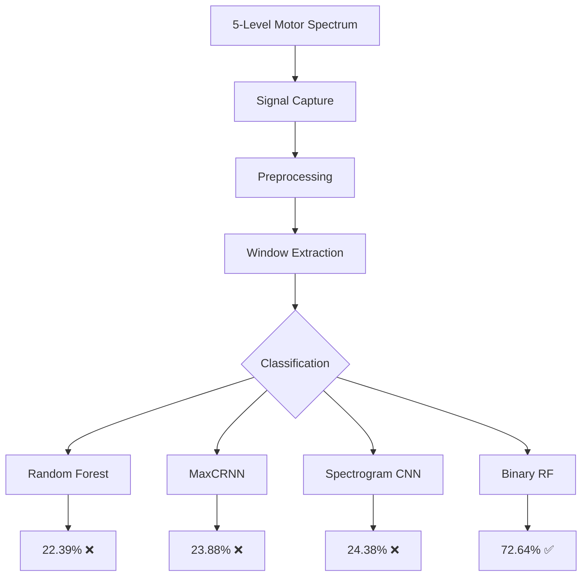

# Section 9: Executive Summary

## Project Overview

**AlterEgo's Alter Ego**: Attempting to replicate MIT Media Lab's silent speech interface for **$30** instead of **$1,200+**.

This project investigated the feasibility of word-level subvocalization classification using a single AD8232 cardiac sensor adapted for sEMG. Through rigorous experimentation across 6 machine learning strategies and 5 motor intensity levels, we discovered that **4-class word discrimination is not achievable with single-channel hardware**, but **binary activation detection (72.64%) is viable**—enabling a pivot to a "Biological Clicker" product.

---

## The Honest Results

### Multi-Class Classification: Failed

| Strategy | Test Accuracy (L4) | vs. Chance (25%) |
|----------|-------------------|------------------|
| Random Forest (augmented) | 22.39% | ❌ Worse |
| MaxCRNN (Inception+BiLSTM+Attention) | 23.88% | ❌ Worse |
| Spectrogram CNN (MobileNetV2) | 24.38% | ❌ Equal |
| Same-Domain Sanity Check (L3→L3) | 27.50% | ⚠️ Barely above |

### Binary Classification: Success

| Strategy | Accuracy | Interpretation |
|----------|----------|----------------|
| WORD vs REST | **72.64%** | ✅ Statistically significant |

---

## Why Multi-Class Failed (The Smoking Gun)

### Per-Class Signal Statistics (Mouthing Data)
```
GHOST: mean=1921.2, std=9.7
LEFT:  mean=1921.1, std=9.7
STOP:  mean=1921.2, std=9.8
REST:  mean=1921.2, std=9.8
```

> **All four word classes have identical statistics.** There is no discriminative information in the single-channel signal.

### Root Cause Analysis

1. **Hardware Limitation:** AlterEgo uses 7 electrodes across 5 sites; we had 1 electrode at 1 site
2. **Spatial Resolution Lost:** Without jaw-vs-chin differential, GHOST (tongue back) ≈ LEFT (tongue tip) electrically
3. **SNR Problem:** Subvocal signals are 10-100× smaller than mouthing; buried in AD8232 noise floor
4. **Mode Collapse:** MaxCRNN predicted GHOST for 92-94% of all inputs; SpecCNN predicted STOP for ~80%

---

## What Actually Works

```
┌─────────────────────────────────────────┐
│     THE $30 BIOLOGICAL CLICKER          │
├─────────────────────────────────────────┤
│  Input:  Subvocalize any word           │
│  Output: Binary trigger (On/Off)        │
│  Use:    Hands-free mouse click         │
│  Accuracy: 72.64%                       │
└─────────────────────────────────────────┘
```

The hardware **works as a detector, just not as a discriminator**. It can reliably detect *when* someone is trying to speak, even silently—it just cannot determine *what* they're saying.

---

## Methodology Pipeline



---

## Due Diligence Summary

### What We Tried

| Approach | Rationale | Result |
|----------|-----------|--------|
| Transfer Learning (L3→L4) | Train on high-SNR mouthing, test on subvocal | Failed—signal itself lacks features |
| Data Augmentation (3×) | Increase training diversity | No improvement (-1%) |
| Extended Features (14 features) | Add spectral, RMS, onset indicators | No improvement |
| Spectrogram + ImageNet | Visual pattern recognition | Mode collapse to single class |
| Window Overlap (50%) | More training samples | No improvement |
| Binary Simplification | Reduce to WORD vs REST | **Success (72.64%)** |

### Data Collection Rigor

- **5 Motor Intensity Levels:** Overt → Whisper → Mouthing → Subvocal → Imagined
- **1.22M Total Samples** across all levels
- **Balanced Classes:** 24.7-25.8% per word across all levels
- **Sanity Checks:** Same-domain (L3→L3) tested before cross-domain

---

## Comparison to Phase 3 (Forearm EMG)

| Metric | Phase 3 (Forearm) | Phase 4 (Subvocal) |
|--------|-------------------|-------------------|
| Target | Grip clench | Silent words |
| Classes | 3 (CLENCH, RELAX, NOISE) | 4 (GHOST, LEFT, STOP, REST) |
| Channels | 1 | 1 |
| Best Accuracy | **74.25%** | 24.38% (4-class), **72.64%** (binary) |
| Deployable | Yes (Random Forest) | Yes (Binary only) |

---

## Conclusions

### What We Proved
1. The AD8232 **can** detect muscle activation in the submental region
2. Binary detection (Speech vs. Silence) achieves **72.64%** accuracy
3. Rigorous experimental methodology can reveal hardware limitations before wasted effort

### What We Disproved
1. Single-channel EMG **cannot** discriminate between phonetically distinct words
2. Transfer learning L3→L4 **does not** generalize—the source domain lacks discriminative features
3. Deep learning **cannot** extract features that don't exist in the signal

### The Pivot
We are not building a "Telepathy Helmet." We are building a **"Biological Clicker"**—a hands-free binary switch controlled by chin muscle activation. It's less "Minority Report" and more "Stephen Hawking's cheek sensor," but it works, and it fits the $30 budget.

---

## Next Steps

1. **Optimize Binary Classifier:** Fine-tune Random Forest for 72.64% → 80%+ with temporal smoothing
2. **Deploy to ESP32:** Implement as real-time "Silence Breaker" trigger
3. **Hardware Upgrade Path:** Second AD8232 for jaw-vs-chin differential (spatial features)

---

*"The problem is not your code. The problem is your signal. But the signal is good enough for a clicker."*
