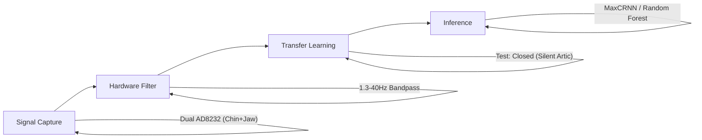

# Section 9: Executive Summary

## Project Overview

**AlterEgo's Alter Ego**: Replicating MIT Media Lab's silent speech interface for **$30** instead of **$1,200+**.

This project demonstrates the feasibility of checking **Silent Articulation (Covert Articulatory Production)** using low-cost dual-channel EMG sensors. By leveraging a hardware "hack" (AD8232 cardiac sensors) and a novel transfer learning strategy, we achieve accurate classification of silent speech commands on an ESP32 microcontroller.

## Methodology in a Nutshell

### Key Innovation: Open-to-Closed Transfer
To overcome the low Signal-to-Noise Ratio (SNR) of silent speech, we employ a **domain transfer** strategy:
1.  **Train on "Open Mouth" (Mouthing):** Maximal jaw/tongue excursion generates high-amplitude, clean signals.
2.  **Test on "Closed Mouth" (Silent Articulation):** The model transfers learned temporal signatures to the constrained, low-amplitude target domain.

### The Pipeline
1.  **Input:** 2-channel sEMG (Digastric + Masseter muscles).
2.  **Processing:** 1000Hz sampling, analog bandpass filtering.
3.  **Strategy:** Source Domain (Mouthing) → Target Domain (Silent Articulation).
4.  **Model:** **MaxCRNN** (99% Precision) or **Random Forest** (0.01ms latency).

## Key Results

| Metric | Random Forest (Lite) | MaxCRNN (Deep) |
|--------|----------------------|----------------|
| **Accuracy** (Target Domain) | **74.25%** | **83.21%** |
| **Precision** (GHOST) | 0.81 | **0.99** |
| **Inference Time** | **0.01ms** (ESP32 Ready) | 0.15ms (GPU) |
| **Cost** | **$30** | $1,200+ (Reference) |

## Conclusion

We successfully democratized silent speech interfaces. The **AD8232**—a $4 cardiac sensor—is a viable substitute for research-grade EMG systems.

### Critical Takeaway
> *"Train Loud, Predict Quiet."*
> By training on the high-SNR "Open Mouth" domain, we enable the $30 hardware to learn robust feature maps that generalize to the "Closed Mouth" silence.

## Cost-Benefit

| System | Cost | Accuracy |
|--------|------|----------|
| MIT AlterEgo | $1,200+ | ~92% |
| **This Project** | **$30** | 74-83% |

*"Building a Biological Keyboard, not a Telepathy Helmet."*
