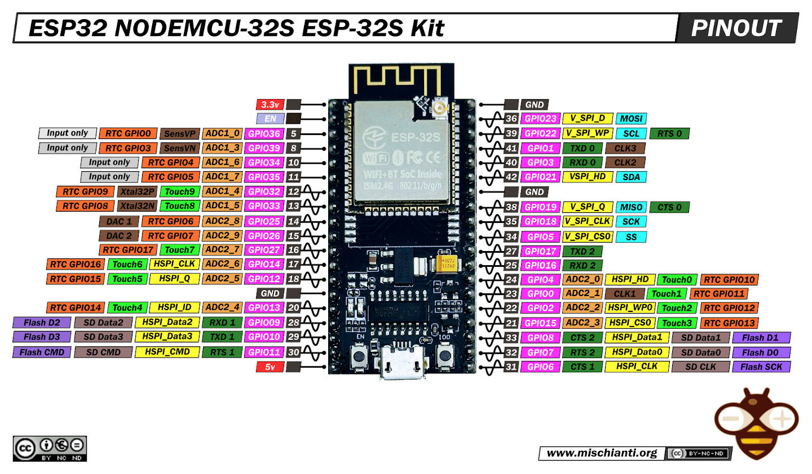

# Breadboard Wiring Guide: ESP32-32S + 2x AD8232

**Date:** December 18, 2024
**Components:** 1x ESP32-32S, 2x AD8232 Heart Monitor, 1x 60-column breadboard

---



## Your Breadboard Layout Explained

```
        ← FAR LEFT COLUMNS (ignore these)

   +  -  │ A B C D E │ gap │ F G H I J │  +  -
   ▲  ▲  │           │     │           │  ▲  ▲
   │  │  │  MAIN     │     │   MAIN    │  │  │
  POWER  │  AREA     │     │   AREA    │ POWER
  RAILS  │           │     │           │ RAILS

        → FAR RIGHT COLUMNS (ignore these)
```

The **extra 2 columns on far left/right** = additional tie-points, often for mounting. **IGNORE THEM** — use only the main A-J columns.

---

## Component Placement (From Your Photo)

```
ROW 0 (USB end)
    ↓
┌─────────────────────────────────────────────────────┐
│  [POWER RAIL +/-]  [A B C D E] gap [F G H I J]      │
│                                                      │
│  Rows 1-15:   ┌──────────────┐                      │
│               │   AD8232 #1  │  ← CHIN sensor       │
│               │   (RED PCB)  │                      │
│               └──────────────┘                      │
│                                                      │
│  Rows 18-32:  ┌──────────────┐                      │
│               │   AD8232 #2  │  ← JAW sensor        │
│               │  (PURPLE PCB)│                      │
│               └──────────────┘                      │
│                                                      │
│  Rows 35-55:  ┌──────────────┐                      │
│               │   ESP32-32S  │  ← Straddle center   │
│               │ (USB at row0)│     gap E|F          │
│               └──────────────┘                      │
│                                                      │
└─────────────────────────────────────────────────────┘
ROW 60
```

---

## AD8232 Pin Identification (Both Modules)

Looking at your purple AD8232 (clearer labels):
```
┌─────────────────────┐
│  LED    ♡   3.5mm   │
│  ●          jack    │
│                     │
│  GND   ────  pin 1  │
│  3.3V  ────  pin 2  │
│  OUTPUT ───  pin 3  │  ← ANALOG SIGNAL (important!)
│  LO-   ────  pin 4  │  ← Leads-off detection (optional)
│  LO+   ────  pin 5  │  ← Leads-off detection (optional)
│  SDN   ────  pin 6  │  ← SHUTDOWN (must tie to 3.3V!)
└─────────────────────┘
```

---

## ESP32-32S Pin Layout

With USB pointing toward row 0:
```
        USB PORT (row ~35)
            ↓
    Left side (E)    Right side (F)
    ─────────────    ─────────────
    3V3              GND
    EN               GPIO23
    GPIO36 (VP) ←──  GPIO22
    GPIO39 (VN) ←──  GPIO1 (TX)
    GPIO34 ←───────  GPIO3 (RX)
    GPIO35           GPIO21
    GPIO32           GND
    GPIO33           GPIO19
    GPIO25           GPIO18
    GPIO26           GPIO5
    GPIO27           GPIO17
    GPIO14           GPIO16
    GPIO12           GPIO4
    GND              GPIO0
    GPIO13           GPIO2
    USB D-           GPIO15
    USB D+           SD1
    5V               SD0
                     CLK
```

> ⚠️ **KEY PINS FOR YOUR PROJECT:**
> - **GPIO34** = Analog input (ADC1_CH6) → AD8232 #1 OUTPUT
> - **GPIO36 (VP)** = Analog input (ADC1_CH0) → AD8232 #2 OUTPUT
> - **3V3** = 3.3V power out
> - **GND** = Ground

---

## WIRING CONNECTIONS
**Confirmed by Carl Kho on 12/19/2024**

> [!CAUTION]
> ### ⚡ THE BREADBOARD POWER RAIL TRAP ⚡
> Full-size (63-row) breadboards have a **BREAK** in the power rails around Row 30!
>
> **Symptoms:** One sensor works (fluctuating), the other reads 0 or 4095 constantly.
>
> **Fix:** Bridge both rails across the gap with jumper wires:
> - Red (+) rail: Row 29 → Row 32
> - Blue (-) rail: Row 29 → Row 32
>
> The painted line may look continuous, but the **metal underneath is cut**.

### Step 1: Power Rails Setup
```
ESP32 3V3  ──────→  + (red) power rail
ESP32 GND  ──────→  - (blue) power rail
```

### Step 2: AD8232 #1 (Red PCB - Chin Sensor)
| AD8232 #1 Pin | Connect To | Wire Color (suggested) |
|---------------|------------|------------------------|
| GND | Power rail (-) | Black |
| 3.3V | Power rail (+) | Red |
| OUTPUT | ESP32 GPIO34 | Yellow |
| SDN | Power rail (+) | White *(for now. should be red.)* |
| **LO+** | **ESP32 GPIO32** | Gray |
| **LO-** | **ESP32 GPIO33** | Magenta |

### Step 3: AD8232 #2 (Purple PCB - Jaw Sensor)
| AD8232 #2 Pin | Connect To | Wire Color (suggested) |
|---------------|------------|------------------------|
| GND | Power rail (-) | Black |
| 3.3V | Power rail (+) | Brown *(for now. should be red.)* |
| OUTPUT | ESP32 GPIO36 (VP) | Orange |
| SDN | Power rail (+) | Green *(for now. should be red.)* |
| **LO+** | **ESP32 GPIO25** | Gray |
| **LO-** | **ESP32 GPIO26** | Magenta |

> ⚠️ **Phase 3 Lesson Learned:** LO+/LO- are NOT optional! They enable leads-off detection which is critical for debugging and filtering bad readings.

---

## Visual Wiring Diagram

```
     + RAIL                              - RAIL
       │                                    │
       ├──── AD8232#1 3.3V                  │
       ├──── AD8232#1 SDN                   ├──── AD8232#1 GND
       │                                    │
       ├──── AD8232#2 3.3V                  │
       ├──── AD8232#2 SDN                   ├──── AD8232#2 GND
       │                                    │
       │                                    │
       │     ┌─────────────┐                │
       └─────┤ ESP32 3V3   │                │
             │             ├────────────────┘
             │    GND      │
             │             │
             │   GPIO34 ←──┼──── AD8232#1 OUTPUT (yellow wire)
             │             │
             │   GPIO36 ←──┼──── AD8232#2 OUTPUT (green wire)
             │    (VP)     │
             └─────────────┘
```

---

## 3.5mm Jack Wiring (From Your Previous Session)

| 3.5mm Segment | Electrode Color | Body Placement |
|---------------|-----------------|----------------|
| Tip | Yellow | Reference (wrist/earlobe) |
| Ring | Green | + electrode |
| Sleeve | Red | - electrode |

---

## Checklist Before Power-On

- [ ] ESP32 straddles center gap (pins in E and F columns)
- [ ] All GND pins connected to blue (-) rail
- [ ] All 3.3V pins connected to red (+) rail
- [ ] **BOTH SDN pins tied to 3.3V** (not floating!)
- [ ] AD8232 #1 OUTPUT → GPIO34
- [ ] AD8232 #2 OUTPUT → GPIO36
- [ ] NO wires touching between rows
- [ ] Power from USB power bank (NOT wall-plugged laptop!)

---

## Next Steps

1. Double-check all connections
2. Power on ESP32 via USB
3. Upload test sketch to read analog values
4. Touch electrodes to verify signal
